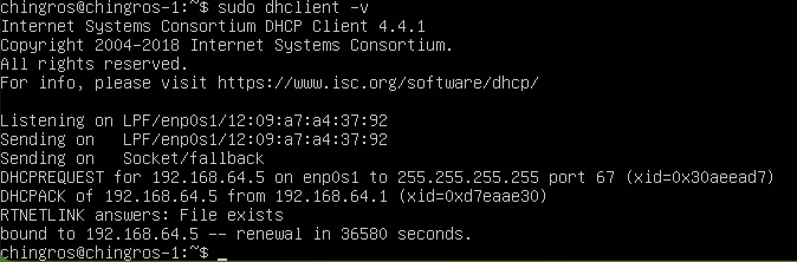
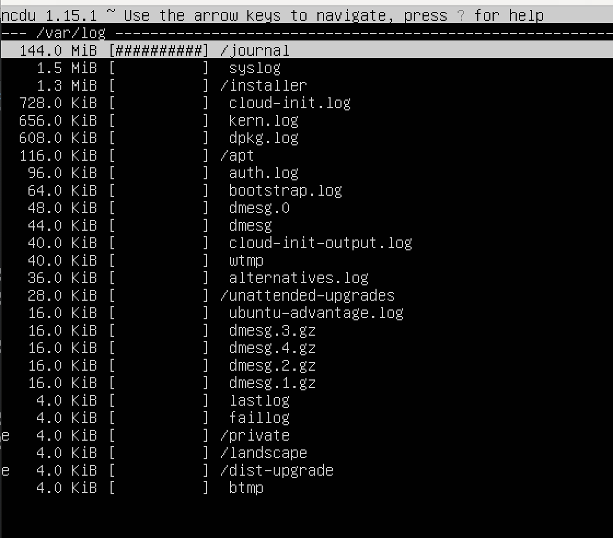

## Part 1. Установка ОС
* Смотрим нашу версию ОС командой:
```
cat /etc/issue
```

## Part 2. Создание пользователя
* Создаем пользователя:
```
sudo useradd {username}
```


* Смотрим в списке нового пользователя и добавляем его в группу: 
```
sudo useradd {username} -G {group name}
```
  
## Part 3. Настройка сети ОС
* Задаем название машины вида user-1 командой 
```
sudo nano /etc/hostname
```
* Устанавливаем временную зону, соответствующую текущему местоположению:
```
timedatectl list-timezones (можно посмотреть список таймзон)
sudo timedatectl set-timezone your_time_zone
```
* Выводим названия сетевых интерфейсов с помощью консольной команды:
```
cat /proc/net/dev
```

Тут мы увидим сетевой интерфейс lo
> lo (loopback device) – виртуальный интерфейс, присутствующий по умолчанию в любом Linux. Он используется для отладки сетевых программ и запуска серверных приложений на локальной машине. С этим интерфейсом всегда связан адрес 127.0.0.1. У него есть dns-имя – localhost. Посмотреть привязку можно в файле /etc/hosts.
* Получим IP адрес 
```
sudo dhclient -v
```

Список адресов, выданых DHCP сервером можно получить командой
```
cat /var/lib/dhcp/dhcpd.leases
```

> DHCP - (англ. Dynamic Host Configuration Protocol — протокол динамической настройки узла) — сетевой протокол, позволяющий сетевым устройствам автоматически получать IP-адрес и другие параметры, необходимые для работы в сети TCP/IP. Данный протокол работает по модели «клиент-сервер». Для автоматической конфигурации компьютер-клиент на этапе конфигурации сетевого устройства обращается к так называемому серверу DHCP и получает от него нужные параметры. Сетевой администратор может задать диапазон адресов, распределяемых сервером среди компьютеров. Это позволяет избежать ручной настройки компьютеров сети и уменьшает количество ошибок. Протокол DHCP используется в большинстве сетей TCP/IP.
* Зададим статичные статичные (заданные вручную, а не полученные от DHCP сервера) настройки ip, gw, dns (используй публичный DNS серверы, например 1.1.1.1 или 8.8.8.8).

  

* Пропингуем  удаленные хосты 1.1.1.1 и ya.ru
```
ping 1.1.1.1
ping ya.ru
```


## Part 4. Обновление ОС
* Обновим все системные пакеты 
```
sudo apt-get upgrade
```

## Part 5. Использование команды sudo
> sudo (англ. Substitute User and do, дословно «подменить пользователя и выполнить») — программа для системного администрирования UNIX-систем, позволяющая делегировать те или иные привилегированные ресурсы пользователям с ведением протокола работы. Основная идея — дать пользователям как можно меньше прав, при этом достаточных для решения поставленных задач. Программа поставляется для большинства UNIX и UNIX-подобных операционных систем. Команда sudo предоставляет возможность пользователям выполнять команды от имени суперпользователя root, либо других пользователей. Правила, используемые sudo для принятия решения о предоставлении доступа, находятся в файле /etc/sudoers (для редактирования файла можно использовать специальный редактор visudo, запускаемый из командной строки без параметров, в том числе без указания пути к файлу); язык их написания и примеры использования подробно изложены в man sudoers(5). В большинстве случаев грамотная настройка sudo делает небезопасную работу от имени суперпользователя ненужной. Все действия оказываются выполнимы из-под аккаунта пользователя, которому разрешено использовать sudo без ограничений. Имеется возможность запрещать и разрешать определённым пользователям или группам выполнение конкретного набора программ, а также разрешить выполнение определённых программ без необходимости ввода своего пароля
* Поменяем hostname с помощью testuser

  
  
## Part 6. Установка и настройка службы времени
* Выведем время нашего часового пояса 
```
timedatectl show
```


## Part 7. Установка и использование текстовых редакторов
* В текстовом редакторе nano что бы выйти с сохранением изменения нужно нажать control + O, затем control+X
* Что бы выйти без сохранения нужно нажать control+X

* В текстовом редакторе Vim что бы выйти со сохранением изменений нужно нажать "ESC" для выхода в "командный режим", вводим ":" (двоеточие), вводим "wq" (write-quit) - для сохранения изменений и выхода
* Что бы выйти без сохранения нужно нажать после "ESC"  ":" (двоеточие), - "q!" - для выхода без сохранения, и нажимаем "Enter".

* В текстовом редакторе mcedit что бы выйти с сохранением нужно нажать F2 и далее F10
* Что бы выйти без сохранения нужно нажать F10

* Файлы после редактирования не изменятся: 


* Что бы в Нано найти тескт нужно ввести - ^ W 
* Что бы изменить текст ввести - ^ \

* Что бы найти текст в VIM нужно нажать / что бы перейти в режим поиска;

* Что бы выполнить поиск в mcedit нужно нажать F7 а для замены F4


## Part 8. Установка и базовая настройка сервиса SSHD
* Установим shhd утилиту 
```bazaar
sudo apt install openssh-server -y
```
* Поставим sshd на автозапуск
```bazaar
sudo systemctl enable ssh
```
* Поменяем порт командой
```
sudo nano /etc/ssh/sshd_config
```

Эта команда выполнит следующие действия:
  - ps aux - выведет список всех процессов в системе, включая информацию о пользователе, использовании памяти и другие детали.
  - | - перенаправляет вывод предыдущей команды в следующую команду.
  - grep sshd - фильтрует вывод предыдущей команды, показывая только строки, содержащие "sshd".


Команда netstat -tan выводит список всех активных сетевых соединений и их состояний на компьютере. Разберем каждую опцию в команде:
- t - отображает только TCP-соединения.
- a - отображает все активные соединения, включая слушающие порты.
- n - отображает IP-адреса и порты в числовом формате, а не в символьном (не выполняет обратное разрешение DNS).

Таким образом, вывод команды netstat -tan содержит информацию о всех активных TCP-соединениях, как локальных, так и удаленных, в числовом формате. Это включает в себя IP-адреса, порты и состояния соединений (например, ESTABLISHED, LISTENING и т. д.).

- Proto: указывает на протокол, используемый для соединения. В данном случае, это TCP.
- Recv-Q: отображает количество байт данных, ожидающих чтения из сокета (полученных, но еще не прочитанных).
- Send-Q: показывает количество байт данных, ожидающих отправки через сокет (отправленных, но еще не подтвержденных).
- Local Address: отображает локальный IP-адрес и порт, связанный с соединением.
- Foreign Address: представляет удаленный IP-адрес и порт, с которым установлено соединение.
- State: указывает на текущее состояние соединения, такое как ESTABLISHED (установленное), LISTEN (ожидание входящего соединения), CLOSE_WAIT (ожидание закрытия соединения) и другие.

* 0.0.0.0 в выводе команды netstat -tan, это означает, что соответствующий адрес или порт является общим для всех сетевых интерфейсов на компьютере. В контексте вывода netstat -tan, 0.0.0.0 может появляться в столбце Local Address или Foreign Address.

- Если 0.0.0.0 появляется в столбце Local Address, это означает, что соответствующий порт прослушивается на всех сетевых интерфейсах компьютера, а не только на одном конкретном.

- Если 0.0.0.0 появляется в столбце Foreign Address, это означает, что соединение установлено с удаленным хостом по адресу 0.0.0.0, что также интерпретируется как "любой доступный адрес".

Таким образом, когда 0.0.0.0 в выводе команды netstat -tan, это указывает на то, что соответствующий адрес или порт является общим для всех сетевых интерфейсов на компьютере.

## Part 9. Установка и использование утилит top, htop
* Установим утилиты top, htop
```
sudo apt install top
sudo apt install htop
```
* Отчет top
```
Uptime: 55 minutes
Количество авторизованных пользователей: 1
Общая загрузка системы: 0.0
Общее количество процессов: 117
Загрузка CPU: 10% пользовательских процессов, 20% системных процессов
Загрузка памяти: 16MB используется из 2GB
PID процесса, занимающего больше всего памяти: 1
PID процесса, занимающего больше всего процессорного времени: 1178

```
* Отчет htop 
* Сортировка по PID

* Сортировка по PERCENT_CPU

* Сортировка по PERCENT_MEM

* Сортировка по TIME 

* Сортировка по процессу sshd

* Сортировка по процессу syslog

* Добавлены hostname, clock и uptime

## Part 10. Использование утилиты fdisk
* Запустим команду 
```
fdisk -l
```
```bazaar
Название жесткого диска: vda
Размер: 10GB
Количество секторов: 20971520
Размер swap: 1229
```


## Part 11. Использование утилиты df
* Введем команду 
```
df
```

* Для корневого раздела (/)
```
Размер раздела - 7865580
Размер занятого пространства - 4612460 
Размер свободного пространства 2832052
Процент использования 62% 
Единица измерения - 1k-blocks
```
* Введем команду 
```
df -Th
```

* Для корневого раздела (/)
```
Размер раздела - 7.6GB
Размер занятого пространства - 4.4GB 
Размер свободного пространства 2.8GB
Процент использования 62% 
Тип файловой системы - ext4
```
## Part 12. Использование утилиты du
* Введем команду, таким образом узнаем размер директорий home - 148K , var - 846M var/log - 125M
```
sudo du -sh /home
```


* Выведем размер всего содержимого в /var/log (не общее, а каждого вложенного элемента, используя *)


## Part 13. Установка и использование утилиты ncdu
* Выведем размер содержимого /home, /var, /var/log

* Перезапустим службу SSHd.


## Part 14. Работа с системными журналами
* Время последней успешной авторизации, имя пользователя и метод входа в систему.


## Part 15. Использование планировщика заданий CRON
* Добавим задачу в планировщик заданий cron
```
crontab -e
```
* Посмотрим список задач 

* Посмотрим в журнале информацию о выполнении
```
 cat /var/log/syslog
```

* Удалим задачу командой
```
crontab -r
```
